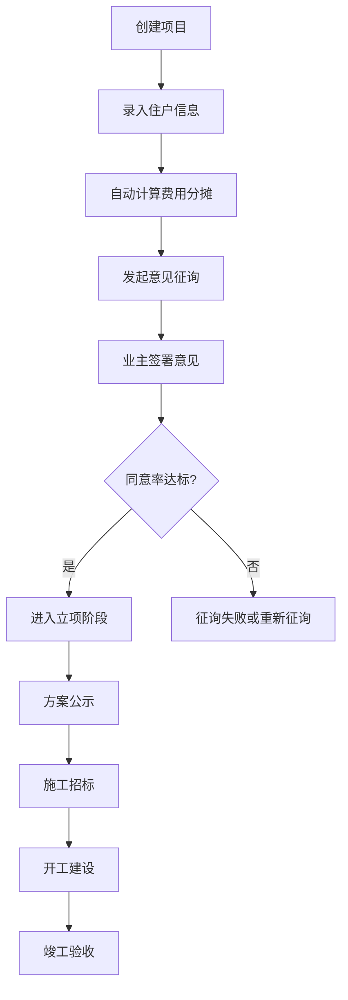

## 1. 产品概述

老旧小区加装电梯意愿征询与进度公示平台，旨在解决老旧小区加装电梯过程中居民意见征集不透明、进度跟踪困难、费用分摊争议等痛点。平台支持单元发起加装电梯项目、自动计算费用分摊比例、线上意见征询签署、全流程进度公示等功能。

- 目标用户：小区业主、业委会、社区工作人员、施工单位
- 产品价值：透明化决策流程、提升协作效率、降低沟通成本、保障各方权益

## 2. 核心功能

### 2.1 用户角色
| 角色 | 核心权限 |
|------|----------|
| 业主 | 查看项目、签署意见、查看进度公示 |
| 项目发起人（业委会/牵头人） | 创建项目、录入住户信息、发起征询、更新进度 |
| 公众访客 | 查看项目列表、查看脱敏后的征询进度与公示信息 |

### 2.2 功能模块
1. **项目列表页**：展示所有加装电梯项目、项目状态概览、搜索筛选
2. **项目详情页**：项目基本信息、住户信息、费用分摊方案
3. **意见征询页**：签署意见（同意/反对/弃权）、填写理由、实时进度展示
4. **进度公示页**：方案公示→施工招标→开工→竣工 四个节点，上传照片与文件
5. **项目创建页**：录入单元信息、添加住户、设置总费用

### 2.3 页面详情
| 页面名称 | 模块名称 | 功能描述 |
|-----------|-------------|---------------------|
| 项目列表页 | 项目卡片列表 | 展示项目名称、小区地址、当前阶段、同意率、进度条 |
| 项目列表页 | 筛选与搜索 | 按状态筛选、按小区名称搜索 |
| 项目详情页 | 项目概览 | 项目基本信息、当前阶段、总费用、住户统计 |
| 项目详情页 | 住户信息表 | 楼层、面积、户主（脱敏）、分摊比例、分摊金额 |
| 项目详情页 | 费用分摊计算 | 根据楼层自动生成建议分摊比例，支持手动调整 |
| 意见征询页 | 征询进度条 | 已签署/总户数、同意/反对/弃权统计 |
| 意见征询页 | 意见列表 | 各户意见展示（脱敏显示户主）、理由 |
| 意见征询页 | 意见签署 | 选择同意/反对/弃权、填写理由、提交签署 |
| 进度公示页 | 时间线节点 | 方案公示、施工招标、开工、竣工四个阶段节点 |
| 进度公示页 | 节点详情 | 每个节点的描述、日期、上传的照片画廊、附件文件 |
| 进度公示页 | 上传功能 | 发起人可上传现场照片和文件 |
| 项目创建页 | 基本信息录入 | 小区名称、单元号、总层数、总费用 |
| 项目创建页 | 住户录入 | 添加/删除住户，录入楼层、面积、户主 |

## 3. 核心流程

### 3.1 项目发起与创建流程
发起人创建项目 → 录入单元基本信息 → 录入每户信息（楼层、面积、户主）→ 系统自动计算费用分摊比例 → 确认分摊方案 → 项目创建成功

### 3.2 意见征询流程
发起人发起征询 → 系统生成征询链接/入口 → 业主进入签署页面 → 选择意见（同意/反对/弃权）→ 填写理由 → 提交签署 → 实时更新征询进度 → 征询结束（达到法定同意率或截止）

### 3.3 进度公示流程
立项成功 → 方案公示（上传方案文件和现场照片）→ 施工招标（上传招标公告和中标文件）→ 开工（上传开工许可和现场照片）→ 竣工（上传竣工验收文件和成果照片）

## 4. 用户界面设计

### 4.1 设计风格
- **主色调**：深青色 #0F766E（稳重、可信）
- **辅助色**：琥珀色 #F59E0B（警示、进度高亮）、绿色 #10B981（同意/完成）、红色 #EF4444（反对）
- **中性色**：石板灰系列（文本、背景）
- **按钮风格**：圆角中等（rounded-lg）、悬浮阴影、过渡动画
- **字体**：标题使用 Noto Serif SC（典雅、稳重），正文使用 Noto Sans SC（清晰易读）
- **布局风格**：卡片式布局、左侧导航、顶部状态栏
- **图标风格**：Lucide React 线性图标，简洁专业

### 4.2 页面设计概述
| 页面名称 | 模块名称 | UI 元素 |
|-----------|-------------|-------------|
| 项目列表页 | Hero 区域 | 渐变背景、大标题、统计数据展示、CTA按钮 |
| 项目列表页 | 项目卡片 | 卡片悬浮效果、进度条、状态标签、关键数据 |
| 项目详情页 | 侧边导航 | 步骤指示器、当前阶段高亮 |
| 项目详情页 | 数据表格 | 条纹行、悬浮高亮、金额数字格式化 |
| 意见征询页 | 进度可视化 | 环形进度图、三色比例条、实时更新 |
| 意见征询页 | 签署表单 | 单选卡片组、文本域、签署确认弹窗 |
| 进度公示页 | 垂直时间线 | 节点连线、完成/进行中/待开始状态、节点卡片 |
| 进度公示页 | 照片画廊 | 网格布局、灯箱预览、上传预览 |
| 项目创建页 | 多步骤表单 | 步骤导航、表单验证、动态住户添加 |

### 4.3 响应式设计
- 桌面端优先（1280px+），使用网格布局
- 平板端（768-1024px）：侧边栏折叠为顶部标签
- 移动端（<768px）：单列布局、卡片堆叠、触摸优化按钮尺寸
