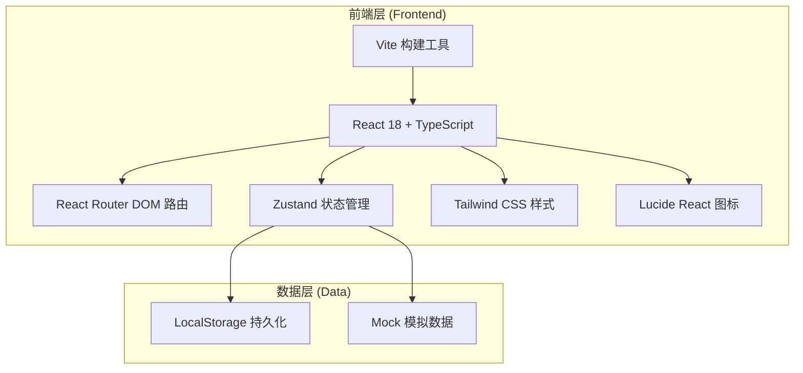
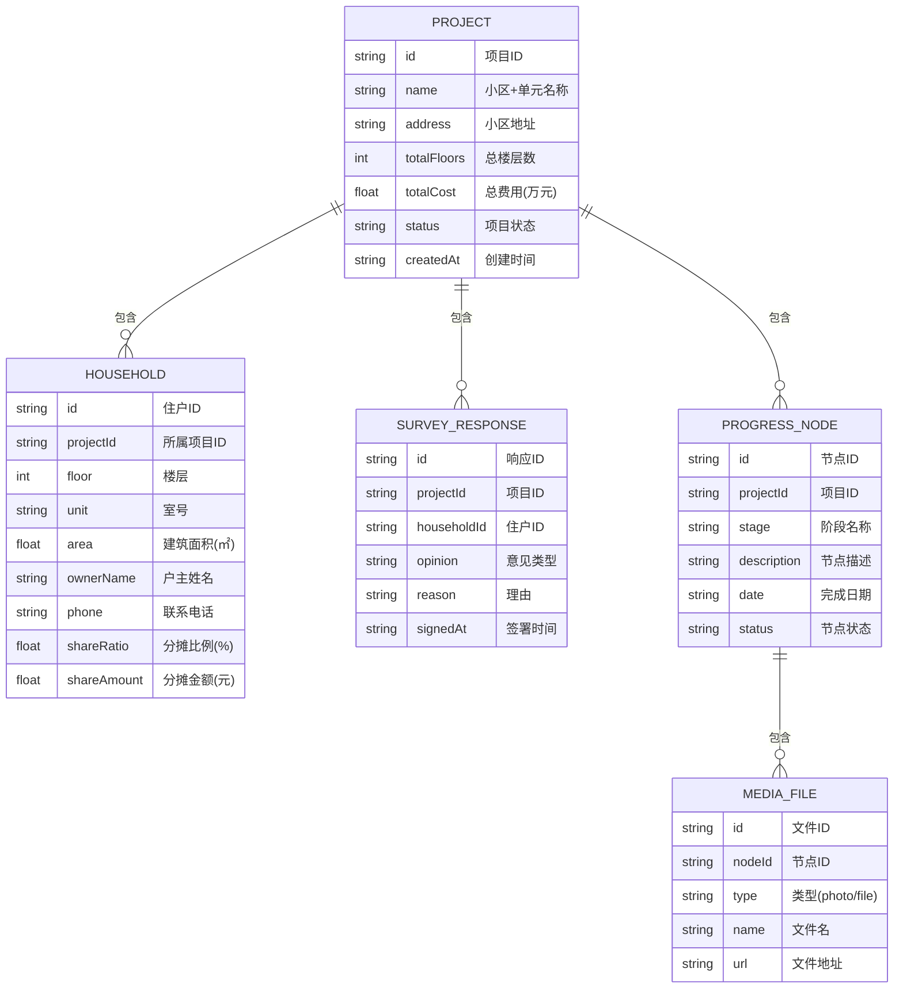

## 1. 架构设计



## 2. 技术说明
- **前端框架**：React@18 + TypeScript
- **构建工具**：Vite@5
- **路由管理**：React Router DOM@6
- **状态管理**：Zustand@4
- **样式方案**：Tailwind CSS@3
- **图标库**：Lucide React
- **数据存储**：LocalStorage（前端持久化）+ Mock 数据（演示用）
- **项目初始化**：使用 react-ts 模板（纯前端项目，无需后端）

## 3. 路由定义
| 路由 | 用途 |
|-------|---------|
| / | 项目列表首页 |
| /projects/create | 创建新项目 |
| /projects/:id | 项目详情（概览） |
| /projects/:id/households | 住户信息与费用分摊 |
| /projects/:id/survey | 意见征询 |
| /projects/:id/progress | 进度公示 |

## 4. 数据模型

### 4.1 数据模型定义



### 4.2 费用分摊算法

根据楼层系数法自动计算分摊比例：
- 1 层：0%（不分摊）
- 2 层：基础比例 8%
- 3 层及以上：每层递增，如 3层=12%，4层=16%，5层=20%，6层=24%...
- 同层多户：按面积比例分摊该层总比例

### 4.3 状态枚举
- **项目状态**：`draft`(草稿) → `surveying`(征询中) → `approved`(已立项) → `planning`(方案公示) → `bidding`(施工招标) → `constructing`(施工中) → `completed`(已竣工)
- **意见类型**：`agree`(同意) / `oppose`(反对) / `abstain`(弃权)
- **节点状态**：`pending`(待开始) / `in_progress`(进行中) / `completed`(已完成)

## 5. 目录结构

```
src/
├── components/          # 通用组件
│   ├── Layout/         # 布局组件
│   ├── ProjectCard/    # 项目卡片
│   ├── ProgressTimeline/ # 进度时间线
│   ├── SurveyChart/    # 征询进度图表
│   └── FileUploader/   # 文件上传组件
├── pages/              # 页面组件
│   ├── Home/           # 首页-项目列表
│   ├── CreateProject/  # 创建项目
│   ├── ProjectDetail/  # 项目详情
│   ├── Households/     # 住户与费用分摊
│   ├── Survey/         # 意见征询
│   └── Progress/       # 进度公示
├── store/              # Zustand 状态管理
│   └── projectStore.ts
├── types/              # TypeScript 类型定义
│   └── index.ts
├── utils/              # 工具函数
│   ├── feeCalculator.ts # 费用分摊计算
│   ├── maskData.ts      # 数据脱敏
│   └── mockData.ts      # Mock 数据
├── App.tsx
├── main.tsx
└── index.css
```
